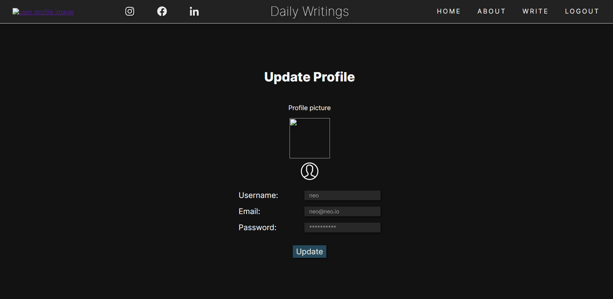
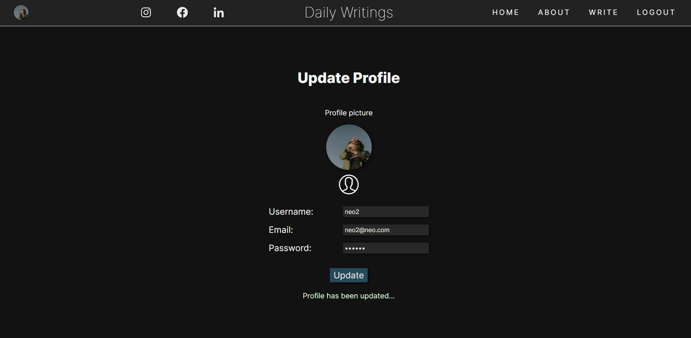
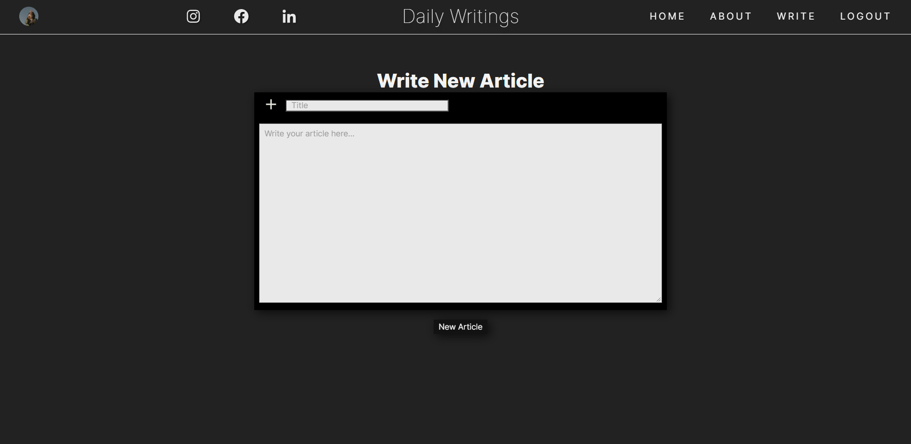

# __DAILY WRITINGS__

# My FIRST MERN STACK

I been working on this project at the same time as a school assignment and my portfolio  
Same idea as a blog, crud system. But i decided to call it daily writings, had articles on a news paper in mind.
This project has a working, write, update, delete function. Also updating profile with image works. 

 

---

# __Languages and Tools:__
- [vscode]
- [react-js]
- [mongodb]
- [nodejs]
- [html]
- [css]
- [javascript]
- [react-router-dom]
- [postman]
- ☕

 

---
 

## Sources:
- Documentation on the websites of each library/framework/tech that I used
- UDEMY
- Youtube
- Traversy Media (React and MongoDb), Net Ninja(React) and Kevin Powell(Sass and css)
- MDN

 

---  

 

##  __Preview__

 &nbsp; &nbsp;
 &nbsp; &nbsp;
 &nbsp; &nbsp;
 &nbsp; &nbsp;
 &nbsp; &nbsp;
 &nbsp; &nbsp;
 &nbsp; &nbsp;
 &nbsp; &nbsp;
 &nbsp; &nbsp;
 &nbsp; &nbsp;

 

---
 

## __My Socials__

- Github - [robonexx](https://github.com/robonexx)
- Instagram - [r.o.b_o.n.e](https://www.instagram.com/r.o.b_o.n.e/)
- Linkedin - [Robert Wägar](https://www.linkedin.com/in/robert-w%C3%A4gar-1b4661139/)
- Portfolio - "In the works"

 

--- 
 

## __Email__
- robertwagar@gmail.com

 
---
 

[vscode]: https://code.visualstudio.com/
[react-js]: https://reactjs.org/ 
[nodejs]: https://nodejs.org/en/
[mongodb]: https://www.mongodb.com/
[postman]: https://www.postman.com/
[javascript]: https://developer.mozilla.org/en-US/docs/Web/JavaScript
[react-router-dom]: https://reactrouter.com/web/guides/quick-start
[html]: https://www.w3schools.com/html/
[css]: https://www.w3.org/Style/CSS/Overview.en.html
[localstorage]: https://developer.mozilla.org/en-US/docs/Web/API/Window/localStorage
